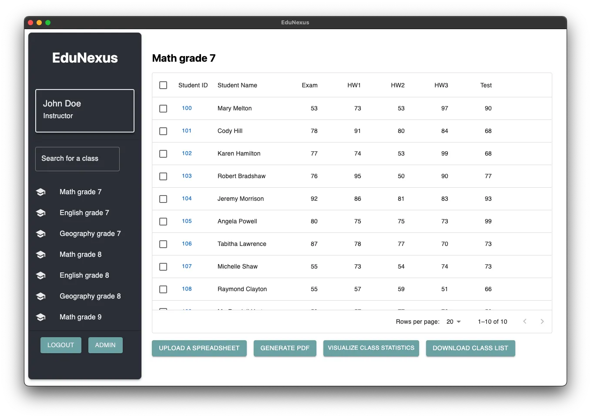

  <h1>
     
    EduNexus
  </h1>
  
  

  [About](#about) • [Installation](#installation) • [Developing](#developing) • [License](#license)

  

View our D4 demo video [here](https://youtu.be/Wcgy5u6DdR0).

## About
EduNexus is an educational support application designed to automate and personalize the exams report generation and student grade keeping process for schools in underprivileged and crisis-stricken regions. We are completing this project **without** a partner organization.

### Report Generation
- **Automated Reports**: Quickly generate detailed student report forms with a few clicks.
- **PDF Generator**: Create and share printable or digital PDF reports for each student.
- **Performance Analyzer**: Offer personalized feedback by analyzing performance metrics to highlight strengths and weaknesses.

### Student Information System
- **Data Management**: Securely input and manage student data, including personal details, enrollment information, and academic records.
- **Progress Monitoring**: Track student progress across various subjects and time periods.
- **Visual Analytics**: Utilize bar and line graphs for a clear visual representation of academic performance.

### Visualization of Student Results
- **Graphical Displays**: Tools to graphically display student results, aiding in the comprehension of academic progress for both students and teachers.

### Lightweight and User-Friendly
- **Ease of Use**: A focus on user-friendly design allows for quick adoption by educators with minimal training.
- **Optimized Performance**: Runs efficiently on various hardware, ensuring accessibility even in regions with limited technological infrastructure.

### User Management
- **Access Control**: Manage user roles with different access levels to maintain data security and privacy.
- **Simplified Workflow**: Easily upload data, generate reports, and download PDFs through a streamlined interface.

## Installation
Download and install the most recent release of the application found in [GitHub Releases](https://github.com/csc301-2024-s/deliverable-1-37-edunexus/releases/latest)

The app runs and is tested on:
- MacOs arm64/x64
- Ubuntu
- Windows x86/x64

## Developing
To continue development on EduNexus please see [CONTRIBUTING.md](./CONTRIBUTING.md)

### Using the pre-packaged database
Admin username: admin
Password: password

Within the admin view, you can add other teachers. Due to an implementation bug, all teachers will be assigned to the same classes but loging in with those new teacher accounts will remove access to the "admin" button allowing management of the school.

## Acknowledgments

EduNexus would like to thank the CSC301 teaching team at the Unversity of Toronto for their help and guidance during the conceptualization and execution phases of this project.

## License
EduNexus is developed to be free and openly accessible to help those who require the software to help them - no matter their situation. As such:

EduNexus is made available under the GNU General Public License version 3 (GPL-3.0). This license allows for free distribution, modification, and use of the software under the condition that any derivative works or modifications are also bound by the same licensing terms.

For more details, see the [GPL-3.0 License](https://www.gnu.org/licenses/gpl-3.0.en.html) and [LICENSE](./LICENSE)