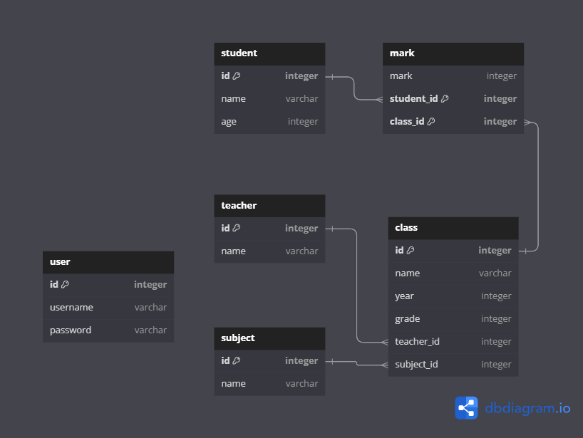

## 1. A summary of your decisions and the options you considered for your component(s) (UI/frontend, logic/backend, database) so your TA knows what you have built and why. 

We opted for SQLite3 due to its compatibility with Electron, as Electron is our choice of library for making a desktop app. Since we are both proficient in PostgreSQL, leveraging the  similarities between SQLite and PostgreSQL made sense. Our database structure encompasses tables for users, students, teachers, subjects, classes, and marks, each storing distinct sets of data. The purpose of the present design is to integrate a system that allows different created components to interact with each other fluently—which is particularly important with all the overlap. By employing references, data duplication is circumvented; for instance, the class table need not contain teacher names but can reference the teacher table for this information. This approach minimizes the need to update multiple tables for a single data modification, greatly enhancing efficiency. Subsequently, we will present an overview of our database structure, along with a brief description of the data stored in each column.

### user

- Login information
    - username
    - password

### student

- Students' personal informations
- Unique to each student
    - student_number: A unique student number for identifying purposes
    - name: student's full name
    - age: student's age

### teacher

- Informations of teachers
- Unique to each teacher
    - name: teacher's name

### subject

- Informations of subjects
- Unique to each subject
    - name: subject name, unique and can be used for indentification

### class

- Informations of classes
- Unique to each class, same class in different year is unique
    - name: name of the class
    - year: the year when the class is active
    - grade: the grade level of the class
    - teacher_number: teacher number of the teacher, can be used to obtain teacher information
    - subject_id: id of the subject, can be used to obtain subject information

### mark

- Student's mark
- Unique to each student on each class, each student should have a different mark for different class
- each class is an new object for student
    - mark: student's mark on one class
    - student_number: student number of the student, can be used to obtain student information
    - class_id: id of the class, can be used to obtain class information
    - student_number and class_id together form a unique key and can be used for identification

Additionally, we have developed a basic Electron front-end for demonstration purposes. This interface allows for the testing of functionalities related to the user, student, and teacher tables.

## 2. Individual contributions explaining who did what.

Kenneth Chan
- Create the database structure
- Write the code for database.js, Electorn front-end for user, student and teacher, first draft for readme and report
- Test the code for user, student and teacher

Carson Zhang 

- Testing for database.js
- SQL overview on adding technology to the program

## 3. All the details and instructions needed for your TA to see and verify your work. You need  to provide enough documentation so your TA can confirm:

### a. Your software does what you say it does.

When user open the application, edunexus.db will be automatically initialized in the directory and user can create, update, delete, and obtain data from multiple tables. Everything should be pretty intuitive despite the simplistic design. For a more detailed demonstration, please refer to the video in [README.md](README.md)

### b. You've done the work (i.e., it's something on your repo/servers, etc.).

- Download and install [Node and npm](https://docs.npmjs.com/downloading-and-installing-node-js-and-npm) if you haven't
- Go into `deliverables/D2`
- run `npm install`
    - run `npm start`, then the application should start
    - Alternatively, you can run `npm run make`, and the same applcation should be built if you are also in a window system.

## 4. Your application (see deployment section below for details)
Please refer to release [D2-37.3]
