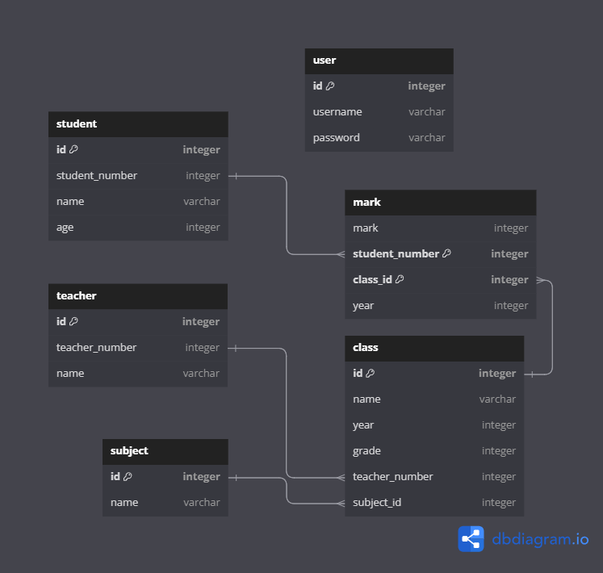

# Database structure

### user
- Login information
    - username
    - password
### student
- Students' personal informations
- Unique to each student
    - name: student's full name
    - age: student's age
### teacher
- Informations of teachers
- Unique to each teacher
    - name: teacher's name
### subject
- Informations of subjects
    - name: subject name, unique variable
### class
- Informations of classes
    - name: name of the class
    - year: the year when the class is active
    - grade: the grade level of the class
    - teacher_id: id of the teacher, can be used to obtain teacher information
    - subject_id: id of the subject, can be used to obtain subject information
### mark
- student's mark
- each class is an new object for student
    - mark: student's mark on one class
    - student_id: id of the student, can be used to obtain student information
    - class_id: id of the class, can be used to obtain class information
