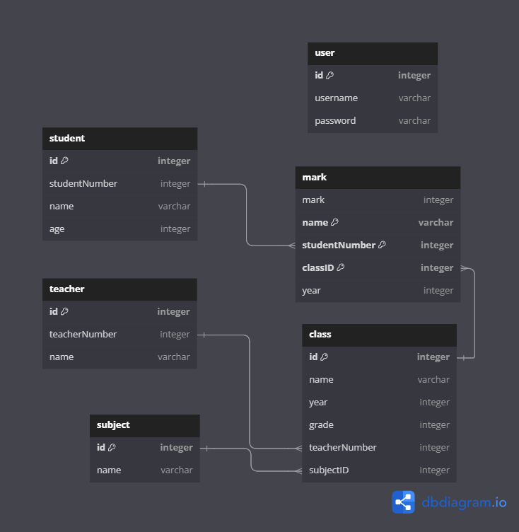

# Database structure


### user

- Login information
    - username
    - password

### student

- Students' personal informations
- Unique to each student
    - studentNumber: A unique student number for identifying purposes
    - name: student's full name
    - age: student's age

### teacher

- Informations of teachers
- Unique to each teacher
    - name: teacher's name

### subject

- Informations of subjects
- Unique to each subject
    - name: subject name, unique and can be used for indentification

### class

- Informations of classes
- Unique to each class, same class in different year is unique
    - name: name of the class
    - year: the year when the class is active
    - grade: the grade level of the class
    - teacheNumber: teacher number of the teacher, can be used to obtain teacher information
    - subjectID: id of the subject, can be used to obtain subject information

### mark

- Student's mark on one assignment/test etc.
- Unique to each student on each assignment on each class
    - each student should have a different mark for different assignment
    - each assignment name should be unique to its class
- each class is an new object for student
    - name: assignment's name
    - mark: student's mark on one assignment
    - studentNumber: student number of the student, can be used to obtain student information
    - classID: id of the class, can be used to obtain class information
    - name, studentNumber and classID together form a unique key and can be used for identification

# Functions
## Required functions
### User related
- `insertUser(username, password)` - Create new user instance
- `checkUserPassword()` - check user password, returns true/false
- `updateUserPassword(username, password)` - update user password, no check is performed
### Student related
- `insertStudent(studentNumber, name, age)` - Create new student instance
- `getStudentByClass(classID)` - filter student with class, returns:
```
[
    {
        studentNumber: integer,
        name: string,
        age: integer
    },
    ...
]
```
### Class related
- `insertClass(name, year, grade, teacherNumber, subjectID)` - Create new class instance
- `getAllClass()` - get all Class instances, returns:
```
[
    {
        name: string,
        year: integer,
        grade: integer,
        teacherNumber: integer,
        subjectID: integer
    }
]
```
### Mark related
- `insertMark(name, mark, studentNumber, classID)` - Create new mark instance
- `getMarkbyStudentAndClass(studentNumber, classID)` - filter Class with student and class, returns:
```
[
    {
        name: string
        mark: integer
    }
]
```
## Optional functions
### Class related
- `getClassbySubject` - filter class by subject
    - if it is not used, dummy subject can be use for D3
- `getClassbyTeacher` - filter class by teacher
    - if it is not used, dummy subject can be use for D3
- `getClassbyYear` - filter class by active year of class
